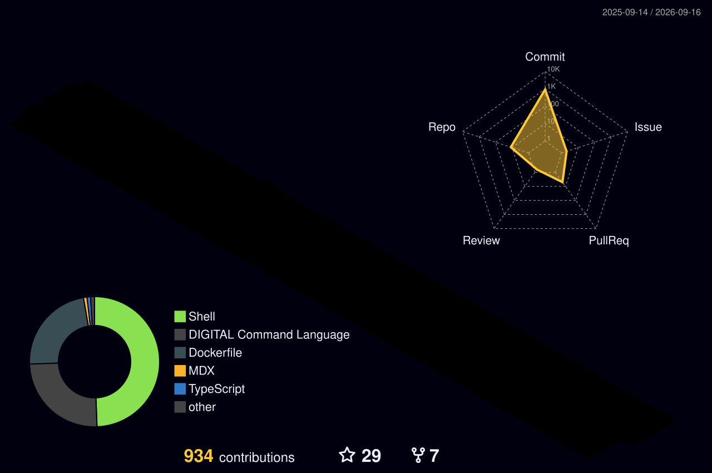

<!-- my-badges start -->

<!-- my-badges end -->

###  👋 Hi there

  

<!--双屏码农-->

### 🔨 Languages and Tools

点击收起 ...

### 💻 Stats

点击展开 ...

<!--  -->

<!-- Snake 3D -->

<!--信息统计-->        <!--修仙等级-->
 

<!--Profile-3D-->

<!--徽章信息  -->

<!--  -->

<!--贡献信息
 -->

<!--语言信息百分比
 -->

<!--语言信息百分比
 -->

### 📕 Latest Blog Posts
<!-- BLOG-POST-LIST:START -->
- 💻 [加固系统安全防范SSH暴力破解之Fail2Ban](https://winjay.cn/?p=7596c6bd-5cbd-4b2d-bc14-0b7257a7469f) 

- 🤡 [谷歌浏览器中编辑并重发请求](https://winjay.cn/?p=e5e0366d-0862-48e9-94b3-250d2a820711) 

- 🎉 [FFMPEG 视频格式转换&amp; 视频压缩](https://winjay.cn/?p=c1ed8221-39d7-41ef-9d6a-3aca0902081f) 

- 👀 [Helm Install Prometheus](https://winjay.cn/?p=fc51bde7-b428-48dd-8cfc-995f584fc0aa) 

- 👺 [离线环境 Docker Jar包启动空指针异常处理](https://winjay.cn/?p=d0483878-c524-4809-83e4-344afd192fe8) 

- 📝 [Info Docker Compose](https://winjay.cn/?p=30871b5e-dae3-44d0-b428-9a3810b6e183) 
<!-- BLOG-POST-LIST:END -->

