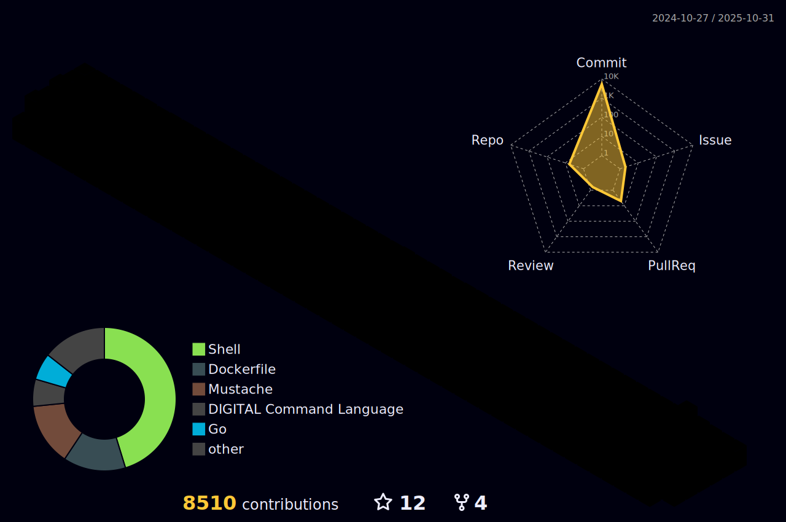

###  👋 Hi there

  

<!--双屏码农-->

### 🔨 Languages and Tools

点击收起 ...

  

### 💻 Stats

点击展开 ...

<!--  -->

<!-- Snake 3D -->

<!--信息统计-->        <!--修仙等级-->
 

<!--Profile-3D-->

<!--徽章信息  -->

<!--  -->

<!--贡献信息
 -->

<!--语言信息百分比
 -->

<!--语言信息百分比
 -->

### 📕 Latest Blog Posts
<!-- BLOG-POST-LIST:START -->
- [随机图片API站点整理](https://winjay.cn/?p=eb12c679-2105-4d89-a3fa-50fef93b3a1e)
- [新装RockyLinux系统操作步骤](https://winjay.cn/?p=fd771571-5e0f-4ad1-980f-3068a056ddd5)
- [配置Containerd运行时镜像加速器](https://winjay.cn/?p=a7eed29e-a0c6-4110-829e-235eea111842)
- [macOS find文件基本操作](https://winjay.cn/?p=86355cae-d6b3-41bb-bb89-49efa92a22e8)
- [macOS系统禁止生成 .DS_Store 文件](https://winjay.cn/?p=682c25a0-c96b-49a4-836e-785e1d315d7d)
<!-- BLOG-POST-LIST:END -->

